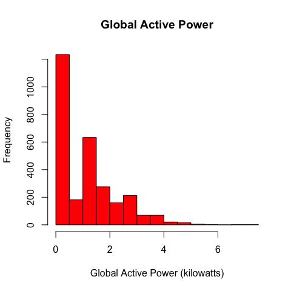
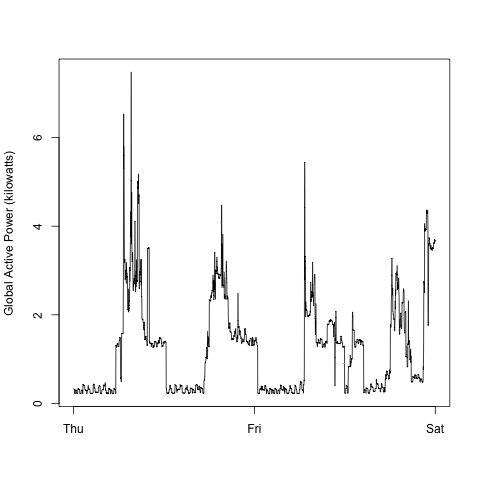
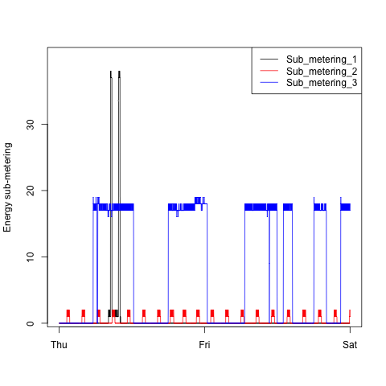
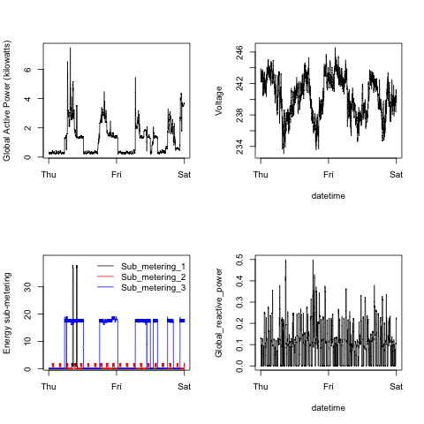

Exploratory Data Analysis  - Week 1 - Course Project #1
========================================================

First of all we download and unzip the data :


```r
download.file("https://d396qusza40orc.cloudfront.net/exdata%2Fdata%2Fhousehold_power_consumption.zip", 
    destfile = "power.zip", method = "curl")
unzip("power.zip")
```


The uncompressed data is quite big, 126.8 MB. There are two approaches to deal with this. I use a Mac and have access to the *sed* parsing utility. I believe it is also available in GitBash if you are using Windows.

**First approach : load the whole data and subset it afterwards**
```
fullData <- read.csv("household_power_consumption.txt",sep=";")
twoDays <- fullData[fullData["Date"] == "1/2/2007" | fullData["Date"] == "2/2/2007",]
```

**Second approach : only load the data you need**

```r
twoDays <- read.table(pipe("sed -n -e '/^[1-2]\\/2\\/2007/p' ./household_power_consumption.txt"), 
    sep = ";", header = FALSE)
dNames <- read.table("household_power_consumption.txt", nrows = 1, sep = ";", 
    header = FALSE, stringsAsFactors = FALSE)
names(twoDays) <- dNames
```


Since I have no idea what will work best for you I will simply write the 2-days dataset back to disk and my plotting scripts will load it later on.


```r
write.csv(file = "twoDays.csv", x = twoDays, row.names = FALSE)
```


**Plot #1**

```r
twoDays <- read.csv("twoDays.csv")
png(filename = "plot1.png", width = 480, height = 480, units = "px", res = 72, 
    bg = "white")
hist(twoDays$Global_active_power, main = "Global Active Power", xlab = "Global Active Power (kilowatts)", 
    col = "red")
dev.off()
```

```
## pdf 
##   2
```




**Plot #2**

```r
twoDays <- read.csv("twoDays.csv")
png(filename = "plot2.png", width = 480, height = 480, units = "px", res = 72, 
    bg = "white")
plot(twoDays$Global_active_power, type = "l", xlab = "", ylab = "Global Active Power (kilowatts)", 
    xaxt = "n")
axis(1, at = c(1, 1440, 2880), labels = c("Thu", "Fri", "Sat"))
dev.off()
```

```
## pdf 
##   2
```




**Plot #3**

```r
twoDays <- read.csv("twoDays.csv")
png(filename = "plot3.png", width = 480, height = 480, units = "px", res = 72, 
    bg = "white")
plot(c(1, 2880), c(1, 40), ylab = "Energy sub-metering", type = "n", xlab = "", 
    xaxt = "n", yaxt = "n")
axis(1, at = c(1, 1440, 2880), labels = c("Thu", "Fri", "Sat"))
axis(2, at = c(0, 10, 20, 30))
lines(twoDays$Sub_metering_1)
lines(twoDays$Sub_metering_2, col = "red")
lines(twoDays$Sub_metering_3, col = "blue")
legend("topright", col = c("black", "red", "blue"), legend = c("Sub_metering_1", 
    "Sub_metering_2", "Sub_metering_3"), lty = c(1, 1))
dev.off()
```

```
## pdf 
##   2
```




**Plot #4**

```r
twoDays <- read.csv("twoDays.csv")

png(filename = "plot4.png", width = 480, height = 480, units = "px", res = 72, 
    bg = "white")

par(mfrow = c(2, 2))

plot(twoDays$Global_active_power, type = "l", xlab = "", ylab = "Global Active Power (kilowatts)", 
    xaxt = "n")
axis(1, at = c(1, 1440, 2880), labels = c("Thu", "Fri", "Sat"))

plot(twoDays$Voltage, type = "l", xlab = "datetime", ylab = "Voltage", xaxt = "n")
axis(1, at = c(1, 1440, 2880), labels = c("Thu", "Fri", "Sat"))

plot(c(1, 2880), c(1, 40), ylab = "Energy sub-metering", type = "n", xlab = "", 
    xaxt = "n", yaxt = "n")
axis(1, at = c(1, 1440, 2880), labels = c("Thu", "Fri", "Sat"))
axis(2, at = c(0, 10, 20, 30))
lines(twoDays$Sub_metering_1)
lines(twoDays$Sub_metering_2, col = "red")
lines(twoDays$Sub_metering_3, col = "blue")
legend("topright", col = c("black", "red", "blue"), bty = "n", legend = c("Sub_metering_1", 
    "Sub_metering_2", "Sub_metering_3"), lty = c(1, 1))

plot(twoDays$Global_reactive_power, type = "l", xlab = "datetime", ylab = "Global_reactive_power", 
    xaxt = "n")
axis(1, at = c(1, 1440, 2880), labels = c("Thu", "Fri", "Sat"))

dev.off()
```

```
## pdf 
##   2
```





